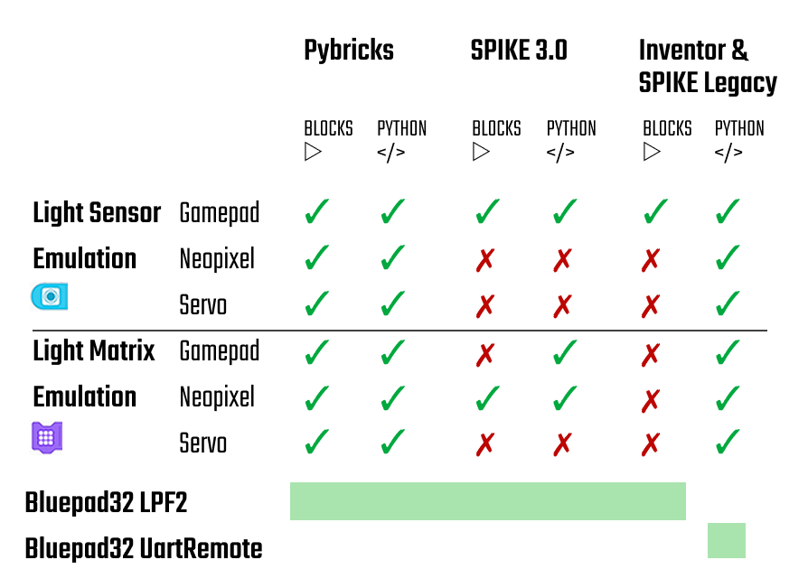

# Examples for BluePad32

Here you find some examples for different applications of the BluePad32 firmware. 

We discern the following types of Lego hubs (look here for an overview of the different firmwares):
- SPIKE3: This is the newest SPIKE Education software running on the yellow SPIKE and SPIKE Essential hubs
- SPIKE Legacy: This is the SPIKE Legacy software which seems still to be supported
 -Inventor: This is the legacy Mindstorms Robot Inventor software which runs on the blue inventor hub and is supported until end of 2024.
- PyBricks: This is the open source alternative firmware that runs on almost any Lego hub

We support two different Bluepad32 firmware:
- BluePad32 LPF2: emulates a LPF2 sensor
- Bluepad32 UartRemote: uses the UART protocol on a hub port

## Pybricks
In order to support BluePad32 on a Pybricks HUB, you need to install the `bluepad.py` library on the Pybricks hub.

### Blocks

### Python

## SPIKE3

### Blocks
### Python

## Inventor & SPIKE Legacy
Both Mindstorm Inventor and SPIKE Prime Legacy use a similar programming environment and examples can be used 

### Blocks
### Python
