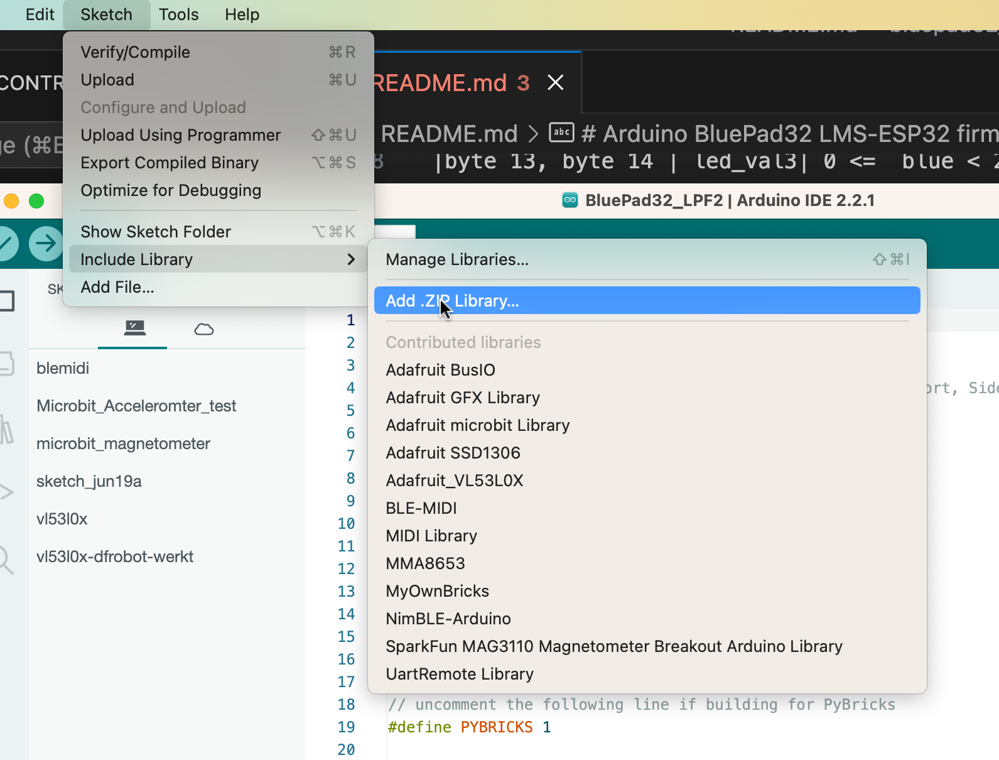

# Arduino BluePad32 LMS-ESP32 firmware

This repository contains two versions of the BluePad32 for running on the LMS-ESP32 board. One version uses our UartRemote protocol (running over a UART connection between the LMS-ESP32 board and the LEGO® robots. The other version emulates the LPF2 protocol and presents itself as a custom sensor from the LEGO® robot's perspective.

## BluePad32_UartRemote

This firmware uses the UartRemote protocol to communicate between the BluePad32 module and a LEGO® robot (such as LEGO® SPIKE prime, LEGO® Robotic Inventor, or LEGO® EV3). This version has more functions compared to the LPF2 version. We added functions to request the BlueTooth address of the currently connected Game Controller. Furthermore, some functions are added to whitelist specific Bluetooth addresses that are allowed to connect to the  BluePad32 firmware. This facilitates the connection in an environment where there are multiple Controllers and multiple LMS-ESP32 boards.
Look in the [BluePad32_UartRemote directory](./Bluepad32_UartRemote) for the implemented UartRemote commands in this firmware.

## BluePad32_LPF2 / Bluepad PyBricks

This firmware emulates an LPF2 (LEGO® Power Function) sensor. It is compatible with PyBricks and with the Block language of the Spike Prime (version 2) and LEGO® Mindstorms app. When the LMS-ESP32 module is connected to a LEGO® robot, the LEGO® robot effectively notices that a 'special' sensor is connected. Using the low-level PUPDevice function on the PyBricks and using special Debug commands for reading and writing low-level sensor values in the LEGO® Block language, we are able to disclose the BluePad32 functions to these environments.

### LPF2 fields

The gamepad reading and output fields are encoded as signed words in 2-byte fields with the following format

|bytes | reading |
|------|--------|
|byte 0, byte 1 | -512 <= Left gamepad X <= 512 |
|byte 1, byte 2 | -512 <= Left gamepad Y <= 512 |
|byte 3, byte 4 | -512 <= Right gamepad X <= 512 |
|byte 5, byte 6 | -512 <= Right gamepad Y <= 512 |
|byte 7, byte 8 | buttons |
| byte 9, byte 10 | Dpad |

For output the following fields are defined:
|bytes | field | reading |
|------|--------|-----|
|byte 0, byte 1 | Servo 0 | |
|byte 1, byte 2 | Servo 1 | |
|byte 3, byte 4 | Servo 2 | |
|byte 5, byte 6 | Servo 3 | |
|byte 7, byte 8 | led_val0| 0< led nr < 64|
|byte 9, byte 10 | led_val1|  0 <= red < 256 |
|byte 11, byte 12 | led_val2| 0 <=  green < 256|
|byte 13, byte 14 | led_val3| 0 <=  blue < 256|

The `led_val0` fields have a special function:

| value of `led_val0` | explanation |
|---------------------|-------------|
| 65		      | write NeoPixel values to leds, led_val1, 2 and 3 no meaning |
| 66	 	 | define Neopixel. `led_val1`: number of pixels, `led_val2': phyical GPIO pin to connect Neopixel 9default 12) |
| 67		| clear all neopixels|

There is a difference in the interpretation of `short` data type sent by the LPF2 sensor between the official LEGO® Spike Prime/LEGO® Mindstorms Inventor and PyBricks firmware. Therefore, you need to choose for which of these two environments you build the firmware. A `#define PYBRICKS 1` is used to build for Pybricks; comment this line when building for the official LEGO® app.

**Note**: This LPF2 implementation is only tested with version 2 of the Spike Prime app and with Mindstroms Inventor app.

# Pre-built firmware

In the [firmware directory](./Pre%20build%20Firmwares), you will find the latest versions of the pre-build firmware for both LPF2 (for both PyBricks and official LEGO®) and UartRemote versions of BluePad32.

# Compiling the firmware
This project heavily leans on the superb [BluePad32 library](). BluePad32 runs on a separate core and deals with all the special Bluetooth protocols for a wide collection of game controllers and aims to unify their capability on a generic GameController object. The BluePad32 library became available as a special hardware Component in the Arduino IDE environment. This makes integration with other Arduino libraries very easy (such as Servo and NeoPixel libraries).

1. Follow the instructions for setting up the required Arduino environment in the [BluePad32 Arduino documentation](https://github.com/ricardoquesada/bluepad32/blob/main/docs/plat_arduino.md).

2. Install the LEGO® Arduino Libraries from this repository. This project depends on two other libraries: the Adafruit_Neopixel and the ESP32Servo library. Both are in the 'Lego Arduino Libraries' folder in this repository. In the Arduino IDE, choose `Sketch > Include Library > Add .ZIP Library`, and select the zip file of the specific library. 

